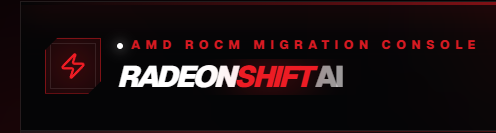
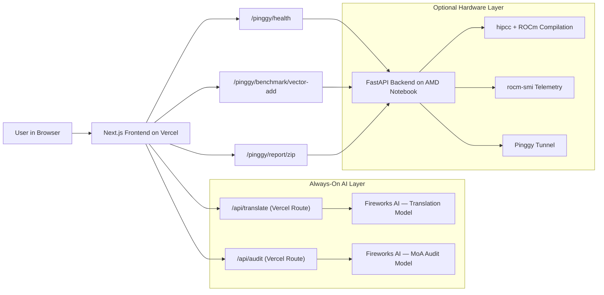

<div align="center">
  
</div>

# RadeonShift AI

**RadeonShift doesn't just translate your CUDA — it catches the bugs that HIPIFY misses, audits the architecture with a Mixture-of-Agents AI, and optionally verifies the fix on real AMD MI300X hardware.**

**Live Demo:** [https://radeon-shift-ai.vercel.app/](https://radeon-shift-ai.vercel.app/)  
**GitHub:** [shashankh3/RadeonShift-AI](https://github.com/shashankh3/RadeonShift-AI)

---

## What RadeonShift Does

1. **Translate** — Deterministic CUDA→HIP translation via AMD's `hipify-perl` logic (no LLM hallucination)
2. **Audit** — Dual-agent AI audit (Fireworks AI) that catches AMD-specific correctness bugs
3. **Verify** — Optionally compile and benchmark on real AMD Instinct MI300X hardware when connected

---

## Why Not Just Use HIPIFY?

| Capability | HIPIFY | RadeonShift |
|---|---|---|
| API renaming | ✅ | ✅ (via hipify-perl) |
| Semantic correctness audit | ❌ | ✅ (MoA dual-agent via Fireworks AI) |
| Wavefront-64 detection | ❌ | ✅ |
| Confidence score from real findings | ❌ | ✅ |
| Compile on AMD hardware | ❌ | ✅ (when notebook connected) |
| Benchmark with telemetry | ❌ | ✅ (when notebook connected) |
| Migration report | ❌ | ✅ |
| Works without hardware | ❌ | ✅ (AI-Only Mode) |
| Graceful degradation | ❌ | ✅ |

---

## Architecture Flow



---

## Runtime Modes

| Mode | Translation | Audit | Benchmark | Telemetry |
|---|---|---|---|---|
| 🟢 **Full Stack** | Live (Fireworks AI) | Live (Fireworks AI) | Live (MI300X hardware) | Live (rocm-smi) |
| 🟡 **AI-Only** | Live (Fireworks AI) | Live (Fireworks AI) | Cached evidence / Unavailable | Unavailable |
| 🟠 **Demo Only** | Demo artifact | Demo artifact | Cached evidence | Unavailable |

> The mode is detected automatically via `/pinggy/health` polling. ModeBanner updates every 30 seconds.

---

## Provenance Rules

All data shown in the UI must be traceable to a clearly labeled source.

| Artifact | Possible Sources | Must Be Labeled As |
|---|---|---|
| Translation | Fireworks live, demo artifact | `fireworks_live` / `demo_artifact` |
| Audit findings | Fireworks live, demo artifact | `fireworks_live` / `demo_artifact` |
| Confidence score | Computed from actual audit findings | Computed dynamically / `—` if no session |
| Benchmark | Live hardware, cached evidence, unavailable | `live` / `cached` / `unavailable` |
| Telemetry | Live notebook only | `live` / `unavailable` |
| GPU name | Live hardware only | Detected (online) / Offline / Unavailable |

---

## Truthful Scorecard Policy

RadeonShift only displays metrics computed from the current session.

- **AI-only mode**: Translation latency is measured. Confidence score is computed from actual Fireworks audit findings. Hardware fields are `null` and hidden.
- **Full-stack mode**: All of the above plus live GPU name, ROCm version, and live benchmark data.
- **Demo-only mode**: All values come from preloaded demo artifacts. Latency shows "N/A".
- Cached benchmark evidence is explicitly labeled "⚠ Cached MI300X Benchmark Evidence — prior verified run." It is never presented as live execution.

---

## Cached Benchmark Policy

When the AMD notebook is offline, RadeonShift shows cached benchmark evidence from a prior verified MI300X run:

- **Kernel:** `warp_reduction`
- **Hardware:** AMD Instinct MI300X (gfx942)
- **Throughput:** 3918 GB/s
- **Elapsed:** 0.026 ms
- **Peak Utilization:** 74.0%

This evidence is labeled `⚠ Cached evidence — hardware not connected. Captured on prior verified run.`  
It is never claimed to be a live result.

---

## Emergency Demo Mode

Activated automatically when Fireworks AI is also unreachable (both AI and hardware down):

- Returns preloaded `DEMO_HIP_OUTPUT` (warpReduce kernel with fixes applied)
- Returns `DEMO_AUDIT_FINDINGS` (1 HIGH + 1 MEDIUM finding from demo kernel)
- Scorecard `execution_mode` is set to `demo_only`
- All displayed data is labeled as demo artifacts
- Report downloads as `RadeonShift_Migration_Report_demo.json`

---

## Deployment Topology

```
┌─────────────────────────────────────┐
│         Vercel (Always On)          │
│                                     │
│  Next.js 16 Frontend                │
│  /api/translate → Fireworks AI      │
│  /api/audit     → Fireworks AI      │
└─────────────────────────────────────┘
                  │
          (optional, when online)
                  │
┌─────────────────────────────────────┐
│    AMD MI300X Notebook (Optional)   │
│                                     │
│  FastAPI backend (uvicorn)          │
│  hipcc + ROCm                       │
│  rocm-smi telemetry                 │
│  Pinggy tunnel → /pinggy/* proxy    │
└─────────────────────────────────────┘
```

- **Vercel** hosts the frontend and all Fireworks-backed AI routes. This layer is always on.
- **AMD notebook** hosts the hardware verification stack. Connected via Pinggy tunnel and accessed through Next.js rewrites at `/pinggy/*`.
- The AI layer and hardware layer are **intentionally decoupled** — either can go offline without breaking the other.
- **Secrets** (`FIREWORKS_API_KEY`) live in Vercel environment variables and are never exposed to the browser.

---

## Environment Variables

### Vercel (server-side — never client-side)
```
FIREWORKS_API_KEY=<secret stored in Vercel project settings>
FIREWORKS_MODEL_TRANSLATE=accounts/fireworks/models/deepseek-v4-flash
FIREWORKS_MODEL_AUDIT=accounts/fireworks/models/deepseek-v4-flash
```

### AMD Notebook / Backend (FastAPI)
```
# No secrets required — the backend does not call Fireworks directly
# The notebook only provides hardware verification endpoints
```

> ⚠️ Never commit `FIREWORKS_API_KEY` to any file. It must only exist as a Vercel environment variable.

---

## Pipeline Stages

1. **Deterministic Translation** — LLM-based hipify translation via `/api/translate` → Fireworks AI
2. **MoA Audit** — Agent A (NVIDIA Purist) + Agent B (AMD Optimizer) via `/api/audit` → Fireworks AI
3. **Hardware Verification** *(optional)* — `hipcc` compile + benchmark + rocm-smi telemetry via notebook
4. **Migration Report** *(when notebook connected)* — ZIP package with source, audit, benchmark, and summary

---

## Bug Patterns Detected

See [BUG_PATTERNS.md](BUG_PATTERNS.md) for the full taxonomy of detectable CUDA→HIP migration bugs.

## Evaluation Methodology

See [EVAL_PLAN.md](EVAL_PLAN.md) for the evaluation and scoring methodology.

## Developer Verification Checklist

See [VERIFY_CHECKLIST.md](VERIFY_CHECKLIST.md) for the full QA checklist covering all runtime modes.

## Latest State Summary

See [LATEST_STATE_SUMMARY.md](LATEST_STATE_SUMMARY.md) for the current architecture state, key files, and known limitations.

---

## Current Scope (v1.0)

**What RadeonShift validates:**
- ✅ Semantic correctness (AI audit agents catch wavefront-64, PTX, shuffle mask bugs)
- ✅ Translation completeness (Fireworks AI + prompt-guided hipify)
- ✅ Confidence score (computed from actual audit findings, not hardcoded)
- ✅ Compilation (hipcc on MI300X — when hardware available)
- ✅ Runtime correctness (benchmark with checksum verification — when hardware available)
- ✅ Performance telemetry (throughput, % of peak — when hardware available)

**Roadmap:**
- Repository-level migration (multi-file projects)
- Automated patch application (currently suggests patches, manual apply)
- Multi-architecture targeting (currently gfx942 only)
- Vercel-hosted report ZIP generation (currently requires notebook)

---

## 📸 Application Workflow


---

## Setup & Installation

1. **Clone the repository:**
   ```bash
   git clone https://github.com/shashankh3/RadeonShift-AI
   cd RadeonShift-AI
   ```
2. **Configure Vercel environment variables** (in Vercel project settings):
   - `FIREWORKS_API_KEY`
   - `FIREWORKS_MODEL_TRANSLATE`
   - `FIREWORKS_MODEL_AUDIT`
3. **Frontend (Next.js):**
   ```bash
   npm install
   npm run dev
   ```
4. **Backend (FastAPI — Remote AMD Notebook, optional):**
   ```bash
   cd backend
   pip install -r requirements.txt
   uvicorn api.main:app --host 0.0.0.0 --port 8000
   # Then expose via Pinggy:
   # ssh -p 443 -R0:localhost:8000 a.pinggy.io
   ```

---

## Pinggy Tunnel Reliability

For long-running tunnels, Pinggy supports auto-reconnecting tunnel scripts, and persistent subdomains are available with Pinggy Pro. A persistent subdomain keeps the public backend URL stable across notebook restarts.

When the Pinggy URL changes, update `next.config.ts`:
```ts
// next.config.ts
destination: 'https://<your-pinggy-subdomain>.free.pinggy.net/:path*'
```

---

## Docker

```bash
docker build -t radeonshift .
docker-compose up
```

---

## Roadmap

- Repository-level migration (GitHub URL or ZIP upload)
- Fine-tuned AMD-specific code model
- Multi-kernel batch migration

---

## Built For

AMD Developer Hackathon ACT II — Unicorn Track

---

**Created by Shashank Hirwani**
