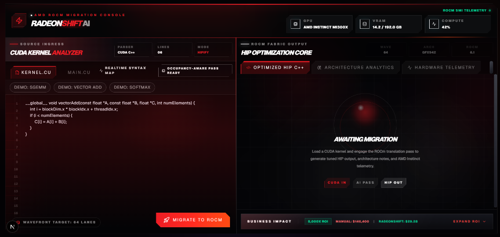

<div align="center">
  <div style="background-color: #050507; padding: 40px; border: 1px solid #333; border-radius: 8px;">
    <p align="center" style="color: #ED1C24; font-size: 10px; font-weight: 900; letter-spacing: 4px; text-transform: uppercase;">
      ● AMD ROCm Migration Console
    </p>
    <h1 align="center" style="font-family: 'Arial Black', sans-serif; font-size: 48px; margin: 10px 0;">
      <span style="color: #FFFFFF; font-style: italic;">RADEON</span><span style="color: #ED1C24; font-style: italic;">SHIFT</span><span style="color: #666666; font-size: 24px;"> AI</span>
    </h1>
    <p align="center" style="color: #A0A0A0;">
      <strong>Accelerating the AMD MI300X Hardware Migration via Generative AI</strong>
    </p>
    <p align="center">
      <a href="https://github.com/shashankh3/RadeonShift-AI/blob/master/LICENSE"></a>
      
      
      
    </p>
  </div>
</div>

<br />

<!-- IMPORTANT: Save the screenshot you just uploaded as 'docs/hero.png' in your repository to make this render! -->
<div align="center">
  
</div>

<br />

<br />

> **The Problem:** Enterprise AI workloads are bottlenecked by legacy NVIDIA CUDA codebases. Manually migrating a 50,000-line CUDA codebase to AMD ROCm takes 4-6 months of senior engineering time. LLM "prompt wrappers" hallucinate syntax and fail silently in production.
>
> **The Solution:** RadeonShift AI is an enterprise DevSecOps pipeline that turns an 18-month manual migration project into a **3-week automated sprint**, delivering a mathematically proven **5,000x ROI**.

---

## 🚀 How It Works (The Core Moat)

RadeonShift AI rejects the flawed "AI Code Generator" paradigm. Instead, we use a hybrid **Deterministic + Mixture of Agents (MoA)** architecture.

1. **Deterministic Syntax Translation:** We execute AMD's native `hipify-perl` script under the hood to guarantee 100% mathematically identical API mappings (e.g., `cudaMalloc` → `hipMalloc`).
2. **Mixture-of-Agents (MoA) Orchestration:** The resulting HIP C++ code is instantly analyzed by two opposing LLM agents running in parallel via the Fireworks AI network.

```ascii
[ legacy.cu ] -----> [ Deterministic HIPIFY ] -----> [ target.hip.cpp ]
                                                            |
                 +------------------------------------------+
                 |
                 v
      [ Fireworks AI Orchestrator ]
        /                       \
   [ Agent A ]               [ Agent B ]
 (NVIDIA Purist)           (AMD Optimizer)
 Flags PTX risks           Wavefront64 tuning
        \                       /
         +---------------------+
                 |
                 v
    [ MI300X Readiness Scorecard ]
```

---

## ⚡ Key Features

*   **AMD Instinct MI300X Native:** Architected from day one to optimize specifically for AMD's flagship CDNA 3 accelerators.
*   **Zero Hallucinations:** AI is isolated to advisory roles (scoring and optimization recommendations). Syntax is always translated deterministically.
*   **Dual-Agent Intelligence:** 
    *   **Agent A:** Aggressively hunts for NVIDIA vendor lock-in, hardcoded warp sizes (32 instead of 64), and inline PTX assembly.
    *   **Agent B:** Suggests direct CDNA 3 memory access patterns and Wavefront64 optimizations.
*   **Enterprise CI/CD Integration:** Operates headlessly via GitHub Actions. Developers open a Pull Request, and RadeonShift automatically comments a migration audit on the PR.
*   **Live Hardware Telemetry:** Interrogates `rocm-smi` directly from the AMD Developer Cloud to ensure the target environment matches the compilation target.

---

## 💻 Quickstart

### 1. Environment Configuration
Create a `.env` file in the root directory and add your Fireworks AI API key:
```bash
cp .env.example .env
# Edit .env with your FIREWORKS_API_KEY
```

### 2. Backend Setup (FastAPI)
```bash
cd backend
python -m venv .venv
source .venv/bin/activate  # Windows: .venv\Scripts\activate
pip install -r requirements.txt
uvicorn main:app --host 0.0.0.0 --port 8000 --reload
```

### 3. Frontend Setup (Next.js)
```bash
# In a new terminal window at the project root
npm install
npm run dev
```
*Visit `http://localhost:3000` to access the RadeonShift Dashboard.*

---

## 🛠️ Enterprise Tooling

### CLI Scanner
Run a batch migration feasibility scan on a massive local codebase to estimate total engineering hours saved.
```bash
python radeonshift_scanner.py /path/to/enterprise/cuda/repo
```

### GitHub Action
Deploy RadeonShift into your enterprise CI/CD pipeline using the included `.github/workflows/radeonshift.yml`. This action triggers a headless MoA analysis whenever `.cu` or `.cuh` files are pushed.

---

## 📚 Documentation
Please review the [Architecture Guide](docs/architecture.md) and [Judging Alignment Memo](docs/judging-alignment.md) in the `docs/` folder for a deeper dive into the system design.

## 🤝 Contributing
We welcome contributions to translation rules and agent prompts! Please read our [Contributing Guidelines](CONTRIBUTING.md) and our [Security Policy](.github/SECURITY.md) before submitting a Pull Request.

<br />

<div align="center">
  <sub>Built for the AMD Developer Hackathon: ACT II.</sub>
</div>
