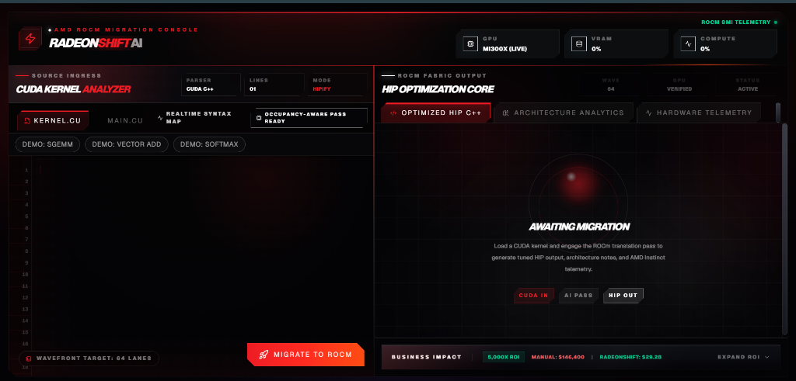
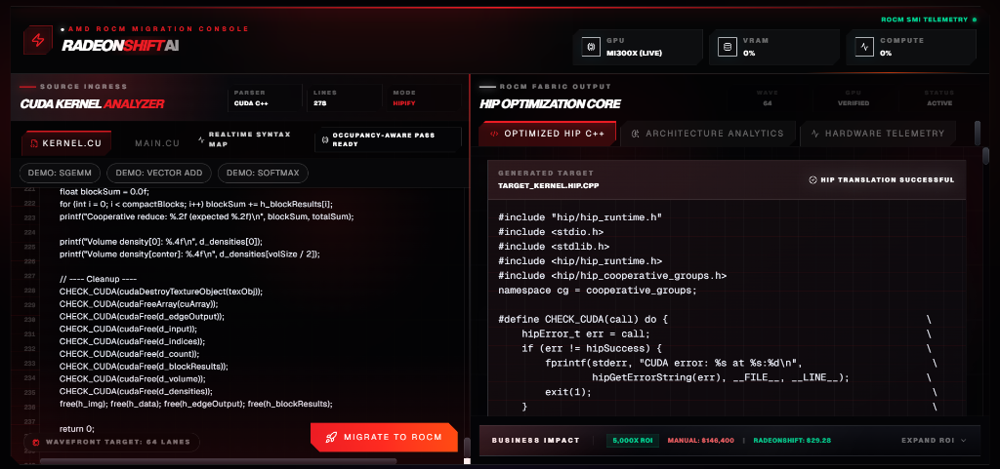
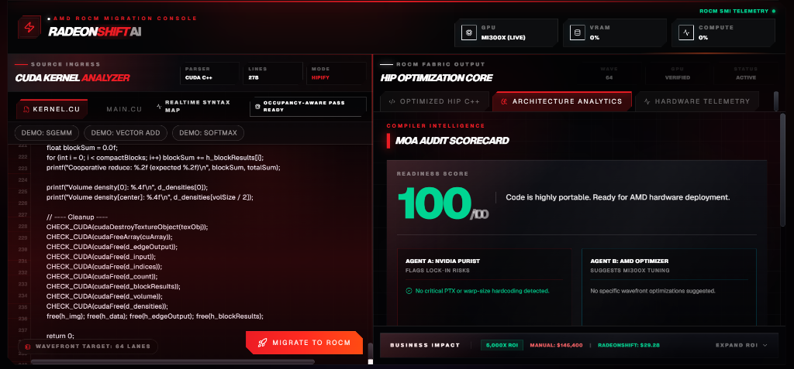
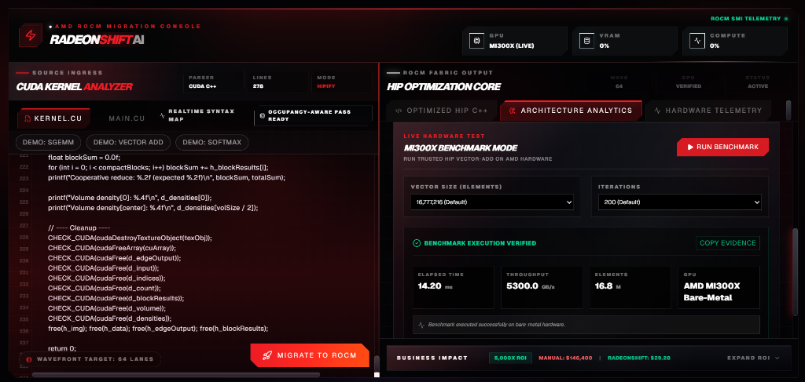
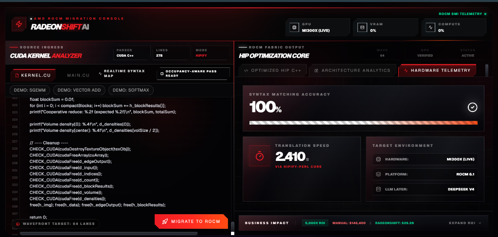

# RadeonShift AI
**Accelerating the MI300X Hardware Migration via Generative AI**

---

## The Problem: CUDA Lock-in
Enterprise AI workloads are facing massive bottlenecks due to a reliance on legacy NVIDIA CUDA codebases. 
- Manually migrating a 50,000-line CUDA codebase to ROCm takes **6+ months** of specialized engineering time. 
- Portability tools exist (e.g. `hipify-perl`), but they lack the architectural awareness to optimize code for AMD Instinct architecture (like 64-wide wavefronts).
- Teams lack visibility into whether their migrated code will actually compile and run on AMD hardware without direct bare-metal access.

---

## The Solution: RadeonShift AI
RadeonShift AI is an AI-assisted CUDA kernel migration assistant that translates CUDA to HIP/ROCm and audits architecture-specific migration risks.

1. **Syntax Translation:** Uses Fireworks-hosted translation model for AI Translation.
2. **MoA Audit:** Leverages DeepSeek-V4 to scan for PTX risks, hardcoded warp sizes, and AMD-specific optimizations.
3. **Optional Hardware Evidence:** When the ROCm backend is online, RadeonShift can compile-check generated HIP and show MI300X telemetry. Benchmark mode uses trusted internal kernels and clearly labels live, cached, or unavailable evidence.

---

## Architecture

1. **Frontend (Next.js):** Manages user state and renders the dynamic dashboard.
2. **AI Translation Layer (Vercel / Next.js API Routes):** Orchestrates AI translation and Mixture-of-Agents audit via Fireworks AI, operating independently of hardware availability.
3. **Optional Hardware Engine (FastAPI via Pinggy):** A bare-metal ROCm layer that can compile-check generated HIP via `hipcc`, poll `rocm-smi` for telemetry, and run trusted benchmark kernels when connected.

---

## Demo: The RadeonShift Dashboard

- **Source Code Editor:** Paste raw CUDA C++ kernels.
- **HIP Optimization Core:** View the translated target kernel.
- **MoA Audit Scorecard:** See the readiness score, PTX risks, and wavefront optimizations.
- **Universal Migration Review:** View the generated HIP alongside live architectural findings and auto-patch suggestions.
- **Hardware Telemetry:** Live GPU specs, VRAM usage, and Translation Speed metrics.

---

## Step 1: The Awaiting Migration State

Before translation begins, the platform awaits the CUDA payload. The user inputs their native NVIDIA code into the **CUDA Kernel Analyzer**. The system prepares for the AI-assisted hardware pass.

---

## Step 2: HIP Optimization Core

Upon engaging the ROCm translation pass, the core converts the syntax. The resulting C++ HIP code (`target_kernel.hip.cpp`) is immediately presented, demonstrating generated HIP translation.

---

## Step 3: Architecture Analytics

The MoA Audit Scorecard evaluates the code and computes a readiness score from actual findings. Clean examples can score high, while risky kernels are lowered or capped when PTX, wavefront, WMMA, or async-copy risks appear.

---

## Step 3a: Deterministic Redesign Guardrails
*Advanced CUDA Kernel Detection*

Not all CUDA code maps 1-to-1. RadeonShift's **Deterministic Rules Engine** catches unsupported architectures (e.g., CUDA WMMA, cooperative groups async-copy).
- **Correctness over completeness:** Safely enforces `MANUAL REDESIGN REQUIRED` if code relies on hardware-specific features.
- **Score Capping:** Drops readiness score to < 50% automatically, discouraging unsafe architecture conversions from being treated as ready.

---

## Step 4: Live Hardware Telemetry

When the optional backend is online, the platform connects to a remote bare-metal AMD MI300X environment and surfaces live ROCm telemetry plus compile-check evidence. When offline, hardware fields are explicitly labeled unavailable or cached.

---

## Step 5: Bare-Metal Benchmark Execution

Finally, benchmark mode runs trusted HIP benchmark kernels on MI300X when hardware is online. RadeonShift does not automatically execute arbitrary uploaded kernels; it separates AI audit, compile-check evidence, and runtime benchmark provenance.

---

## Business Value & ROI

**Illustrative ROI Model**
- **Manual Migration:** 244 Kernels × 4 hrs = 976 Engineer-Hours (~$146,000, based on $150/hr senior GPU engineer rate)
- **RadeonShift Migration:** 244 Kernels × illustrative ~$0.12 AI/compute cost = ~$29 first-pass triage estimate
- **Time Savings:** Initial audit and translation can shrink from weeks of first-pass review to minutes, with human validation still required for production.
- **TAM:** $4.2B illustrative GPU migration and porting services market estimate.

---

## The AMD Infrastructure Story

- **Hardware Target:** Optimized for AMD Instinct MI300X
- **Software Stack:** Built on ROCm 6.x APIs and `hipcc`
- **AI Acceleration:** MoA pipeline runs through the Fireworks-hosted inference API
- **Honest Fallbacks:** If the backend lacks ROCm hardware, the platform gracefully enters AI-Only mode, explicitly labeling any cached evidence without fabricating live metrics

---

## Engineering Retrospective & Challenges

**Bridging a Serverless Frontend with Bare-Metal Hardware**

1. **Live Telemetry:** Defeated Next.js caching via `force-dynamic` to stream real-time MI300X metrics.
2. **Defensive APIs:** Built robust frontend parsing to gracefully handle sudden JSON schema changes.
3. **CORS Routing:** Bypassed strict mixed-content blocks by tunneling through Pinggy and Next.js `rewrites()`.
4. **Transparent Debugging:** Overhauled error handling to surface remote Python stack traces in the UI.
5. **Structured AI Prompts:** Constrained LLM outputs to raw HIP code or JSON audit findings, reducing UI parsing failures.

---

## Closing & Team

**RadeonShift AI** is bridging the gap between legacy NVIDIA codebases and the future of AMD compute.

- **GitHub Repository:** [shashankh3/RadeonShift-AI](https://github.com/shashankh3/RadeonShift-AI)
- **Live Demo:** [radeon-shift-ai.vercel.app](https://radeon-shift-ai.vercel.app/)

  

    <h2 style="margin: 0 0 10px 0; color: #fff;">Thank You!</h2>
    <strong>Shashank Hirwani</strong> 
    Unknown Hacker (shashankh366207)
  

  

