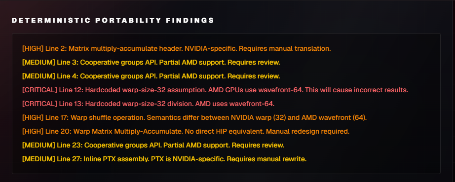
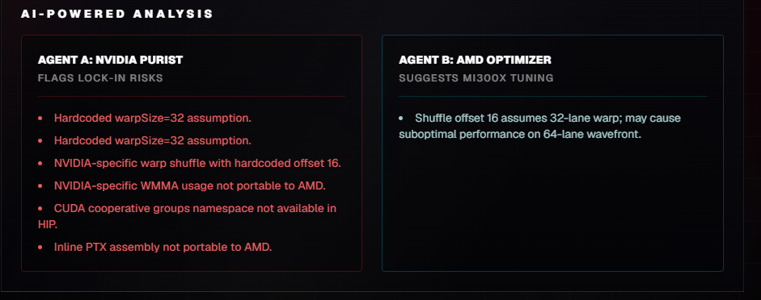
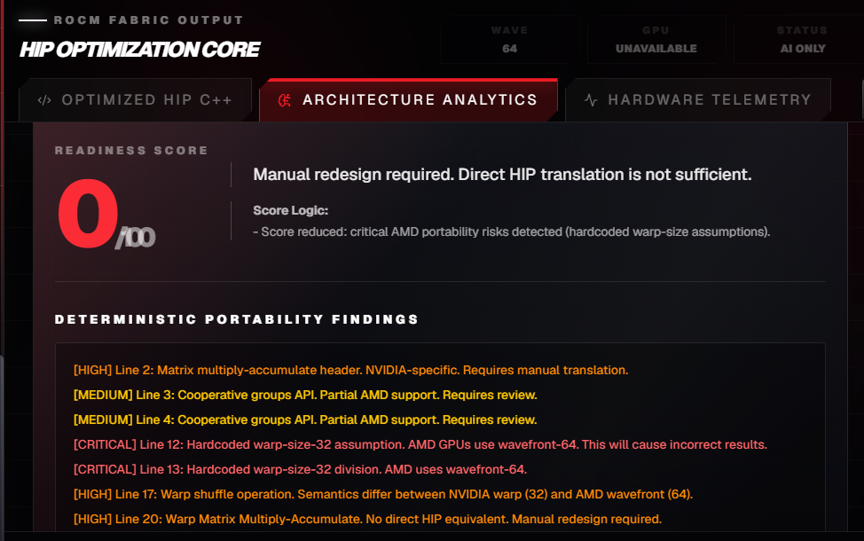

# RadeonShift AI
**Accelerating the MI300X Hardware Migration via Generative AI**

---

## The Problem: CUDA Lock-in
Enterprise AI workloads are facing massive bottlenecks due to a reliance on legacy NVIDIA CUDA codebases. 
- Manually migrating a 50,000-line CUDA codebase to ROCm takes **6+ months** of specialized engineering time. 
- Portability tools exist (e.g. `hipify-perl`), but they lack the architectural awareness to optimize code for AMD Instinct architecture (like 64-wide wavefronts).
- Teams lack visibility into whether their migrated code will actually compile and run on AMD hardware without direct bare-metal access.

---

## The Solution: RadeonShift AI
RadeonShift AI is an AI-assisted CUDA kernel migration assistant that translates CUDA to HIP/ROCm and audits architecture-specific migration risks.

1. **Syntax Translation:** Uses Fireworks-hosted translation model for AI Translation.
2. **MoA Audit:** Leverages DeepSeek-V4 to scan for PTX risks, hardcoded warp sizes, and AMD-specific optimizations.
3. **Optional Hardware Evidence:** When the ROCm backend is online, RadeonShift can compile-check generated HIP and show MI300X telemetry. Benchmark mode uses trusted internal kernels and clearly labels live, cached, or unavailable evidence.

---

## Architecture

1. **Frontend (Next.js):** Manages user state and renders the dynamic dashboard.
2. **AI Translation Layer (Vercel / Next.js API Routes):** Orchestrates AI translation and Mixture-of-Agents audit via Fireworks AI, operating independently of hardware availability.
3. **Optional Hardware Engine (FastAPI via Pinggy):** A bare-metal ROCm layer that can compile-check generated HIP via `hipcc`, poll `rocm-smi` for telemetry, and run trusted benchmark kernels when connected.

---

## Demo: The RadeonShift Dashboard

- **Source Code Editor:** Paste raw CUDA C++ kernels.
- **HIP Optimization Core:** View the translated target kernel.
- **MoA Audit Scorecard & Universal Review:** See readiness scores, live PTX/wavefront findings, and auto-patch suggestions.
- **Hardware Telemetry:** Live GPU specs, VRAM usage, and Translation Speed metrics.

---

## Step 1: The Awaiting Migration State

Before translation begins, the platform awaits the CUDA payload. The user inputs their native NVIDIA code into the **CUDA Kernel Analyzer**. The system prepares for the AI-assisted hardware pass.

---

## Step 2: HIP Optimization Core

Upon engaging the ROCm translation pass, the core converts the syntax. The resulting C++ HIP code (`target_kernel.hip.cpp`) is immediately presented, demonstrating generated HIP translation.

---

## Step 3: Architecture Analytics (1/2)

The MoA Audit Scorecard evaluates code through two distinct layers:

**Layer 1 — Deterministic Risk Detection:**
Hardcoded rule-based scanners check for known AMD portability risks before any AI analysis runs. Patterns detected:
- Hardcoded warp-size assumptions (`% 32`, `/ 32`) → **CRITICAL**
- Warp shuffle operations (`__shfl`) → **HIGH**
- WMMA / matrix multiply-accumulate (`wmma`, `mma.h`) → **HIGH**
- Async memory copy (`cuda::memcpy_async`) → **HIGH**
- Cooperative groups → **MEDIUM**
- Inline PTX assembly → **MEDIUM**

---

## Step 3: Architecture Analytics (2/2)

**Layer 2 — AI-Powered Analysis:**
The MoA pipeline then runs semantic analysis for deeper architectural risks the deterministic layer cannot catch alone.

Both layers are displayed separately in the report, giving judges and engineers full transparency into what was caught by rules vs. what was caught by AI.

---

## Step 3a: Deterministic Redesign Guardrails

**Advanced CUDA Kernel Detection**
RadeonShift's Deterministic Rules Engine catches unsupported architectures before AI translation is trusted. The engine runs independently of the AI pipeline and surfaces findings in a dedicated "Deterministic Portability Findings" section.

**Patterns Detected:**
- Hardcoded warp-32 assumptions (`% 32`, `/ 32`) → **CRITICAL:** breaks on AMD wavefront-64
- Warp shuffle operations (`__shfl_sync`, `__shfl_up`, `__shfl_down`, `__shfl_xor`) → **HIGH:** semantics differ across architectures
- WMMA / `mma.h` → **HIGH:** no direct HIP equivalent, manual redesign required
- `cuda::memcpy_async` / `__pipeline_memcpy_async` → **HIGH:** async copy API differs on AMD
- `cooperative_groups` → **MEDIUM:** partial AMD support, requires review
- Inline PTX (`asm`) → **MEDIUM:** NVIDIA-specific, requires manual rewrite

---

## Step 3a: Score Capping & Logic

**Correctness over Completeness:**
Safely enforces `MANUAL REDESIGN REQUIRED` if code relies on hardware-specific features.

**Score Capping:**
Drops readiness score to < 50% automatically when CRITICAL or HIGH deterministic findings are present, discouraging unsafe architecture conversions from being treated as ready.

**New — Explainable Score Logic:**
The score now includes a visible explanation line showing exactly why the confidence was reduced:
- "Score reduced: critical AMD portability risks detected"
- "Score capped: unsupported CUDA features require manual redesign"
- "Flagged for review: NVIDIA-specific constructs detected"
- "No deterministic portability risks detected" (when clean)

Judges can trace every score change to a specific deterministic finding or AI finding.

---

## Step 4: Live Hardware Telemetry

When the optional backend is online, the platform connects to a remote bare-metal AMD MI300X environment and surfaces live ROCm telemetry plus compile-check evidence.

When offline, the platform now enters Demo Mode — a guaranteed static sample result is loaded containing a complete wavefront-bug detection flow, so the full product can always be demonstrated regardless of backend status.

---

## Step 4: Transparency & Provenance

Three transparency states are clearly labeled in the UI:
- **LIVE:** Real-time MI300X telemetry active
- **CACHED:** Previously fetched evidence displayed with timestamp
- **DEMO MODE:** Static guaranteed sample loaded, clearly labeled as demo data

No state is ever hidden or ambiguous — the provenance of every metric is always visible.

---

## Step 5: Bare-Metal Benchmark Execution

Finally, benchmark mode runs trusted HIP benchmark kernels on MI300X when hardware is online. RadeonShift does not automatically execute arbitrary uploaded kernels; it separates AI audit, compile-check evidence, and runtime benchmark provenance.

---

## Business Value & ROI

**Illustrative ROI Model**
- **Manual Migration:** 244 Kernels × 4 hrs = 976 Engineer-Hours (~$146,000, based on $150/hr senior GPU engineer rate)
- **RadeonShift Migration:** 244 Kernels × illustrative ~$0.12 AI/compute cost = ~$29 first-pass triage estimate
- **Time Savings:** Initial audit and translation can shrink from weeks of first-pass review to minutes, with human validation still required for production.

---

## Trust & Market Size

**New — Trust Through Deterministic Guardrails:**
Unlike AI-only translation tools, RadeonShift's deterministic rules engine catches critical AMD portability risks before AI output is trusted, reducing false-confidence migrations and ensuring engineers know exactly which kernels need manual redesign.

**TAM:** $4.2B illustrative GPU migration and porting services market estimate.

---

## The AMD Infrastructure Story

- **Hardware Target:** Optimized for AMD Instinct MI300X
- **Software Stack:** Built on ROCm 6.x APIs and `hipcc`
- **AI Acceleration:** MoA pipeline runs through the Fireworks-hosted inference API
- **Deterministic Engine:** Standalone rule-based portability scanner runs independently of AI, catching hardcoded warp assumptions, WMMA, async-copy, and PTX risks
- **Honest Fallbacks:** If the backend lacks ROCm hardware, the platform enters Demo Mode with a guaranteed static sample, explicitly labeling all evidence as demo data without fabricating live metrics

---

## Engineering Retrospective (1/2)

**Bridging a Serverless Frontend with Bare-Metal Hardware**

1. **Live Telemetry:** Defeated Next.js caching via `force-dynamic` to stream real-time MI300X metrics.
2. **Defensive APIs:** Built robust frontend parsing to gracefully handle sudden JSON schema changes.
3. **CORS Routing:** Bypassed strict mixed-content blocks by tunneling through Pinggy and Next.js `rewrites()`.
4. **Transparent Debugging:** Overhauled error handling to surface remote Python stack traces in the UI.

---

## Engineering Retrospective (2/2)

**Adding Deterministic Safety & Demo Stability**

5. **Structured AI Prompts:** Constrained LLM outputs to raw HIP code or JSON audit findings, reducing UI parsing failures.
6. **Deterministic + AI Separation:** Built a standalone rules engine that runs before AI analysis, surfacing findings in a separate UI section so judges and engineers can distinguish rule-based detection from AI inference.
7. **Explainable Score Logic:** Added visible score explanation lines so every confidence change is traceable to a specific finding, eliminating "black box AI score" concerns.
8. **Demo-Safe Fallback:** Built a guaranteed static sample mode so the full product flow — deterministic detection, AI audit, score explanation, and provenance — can always be demonstrated even when bare-metal hardware is unavailable.

---

## Closing & Team

**RadeonShift AI** is bridging the gap between legacy NVIDIA codebases and the future of AMD compute — with deterministic guardrails that ensure every migration is safe, explainable, and honest.

- **GitHub Repository:** [shashankh3/RadeonShift-AI](https://github.com/shashankh3/RadeonShift-AI)
- **Live Demo:** [radeon-shift-ai.vercel.app](https://radeon-shift-ai.vercel.app/)

  

    <h2 style="margin: 0 0 10px 0; color: #fff;">Thank You!</h2>
    <strong>Shashank Hirwani</strong> 
    Unknown Hacker (shashankh366207)
  

  

